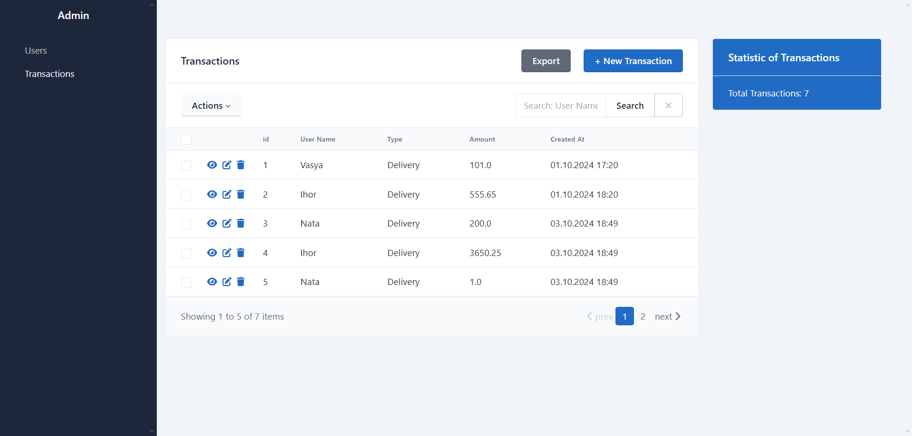

## Users with transactions Service

Users with Transactions Service (CRUD application) is a web application for managing Users with Transactions

## Entities:

2. Users
3. Transactions

## Setup:

### option 1
1. Clone the project:

## Usage local:

> 1. Go to the url where our documentation (swagger) was launched http://127.0.0.1:7000
> 2. You can use all CRUD operations with models User and Transactions:
> 3. Go to the url where our admin panel http://127.0.0.1:8000/admin

