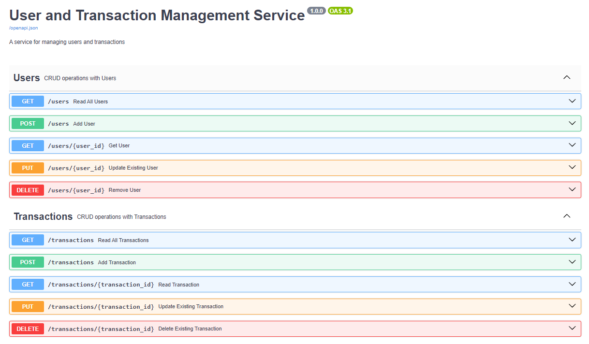

## Users with transactions Service

Users with Transactions Service (CRUD application) is a web application for managing Users with Transactions

## Entities:

1. Users
2. Transactions

## Setup:

1. Clone the project: ```git clone https://github.com/IhorVoskoboinikov/users_with_transactions.git```
2. Create .env file as .env.example (you can use test data from .env.example in .env)
3. Install Docker (Docker-compose), if it is not installed
4. Run command ```docker-compose up``` 

## Usage local (use PORT from .env.example):

> 1. Go to the url where our documentation (swagger) was launched http://127.0.0.1:7000/docs
> 2. You can use all endpoints with CRUD operations
> 3. Go to the url where our admin panel http://127.0.0.1:7000/admin

(sdfsdfs)


